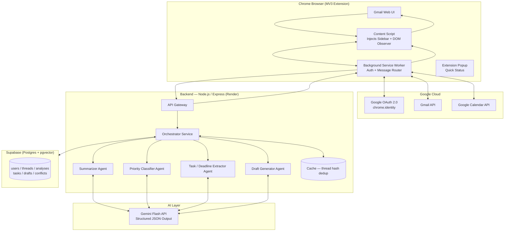
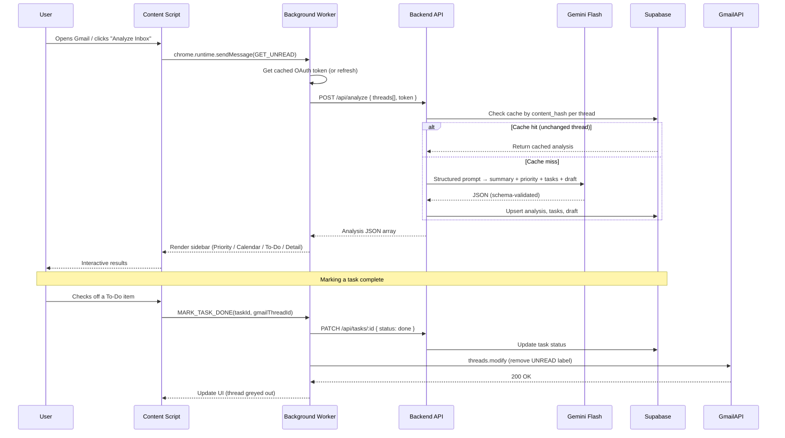
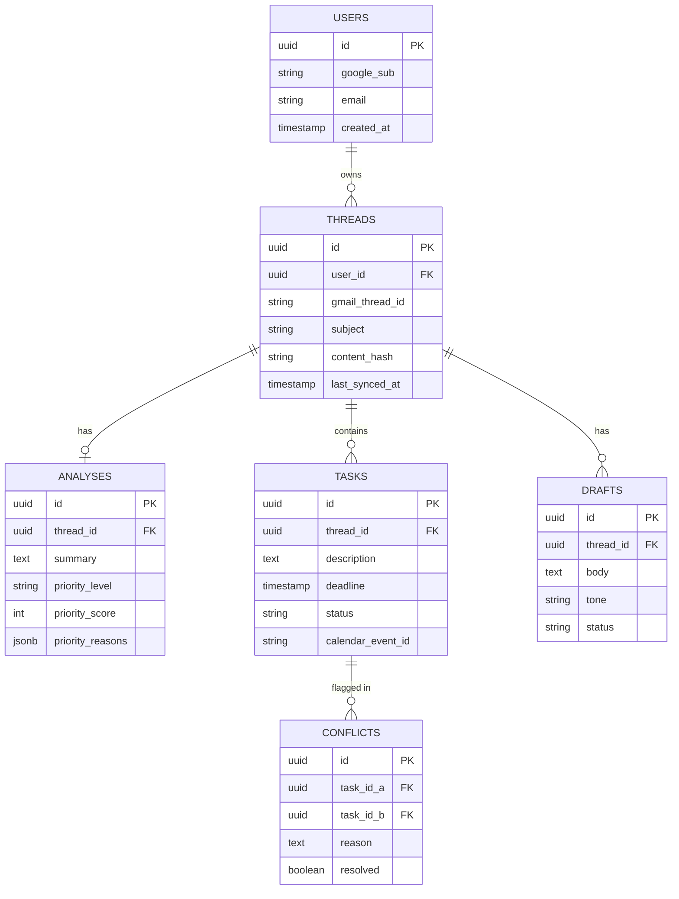

# 📬 InboxPilot — AI Email Assistant for Gmail
### Prodapt Hackathon — Technical Architecture & Execution Document

> **Elevator pitch:** InboxPilot is a Gmail-native browser extension that reads your unread mail, tells you what actually matters, pulls out every task and deadline hiding in the text, and drafts the reply — all with a human always in the loop before anything gets sent.

---

## Table of Contents
1. [Problem Statement](#1-problem-statement)
2. [Solution Overview](#2-solution-overview)
3. [High-Level Architecture](#3-high-level-architecture)
4. [Data Flow (Sequence Diagram)](#4-data-flow-sequence-diagram)
5. [Tech Stack & Justification](#5-tech-stack--justification)
6. [Folder Structure](#6-folder-structure)
7. [API Contract (Build This First)](#7-api-contract-build-this-first)
8. [Database Schema](#8-database-schema)
9. [Module Deep-Dives](#9-module-deep-dives)
   - [9.1 Authentication & Gmail Sync](#91-authentication--gmail-sync)
   - [9.2 Summarization Module](#92-summarization-module)
   - [9.3 Priority / Triage Module](#93-priority--triage-module)
   - [9.4 Task & Deadline Extraction Module](#94-task--deadline-extraction-module)
   - [9.5 Draft Response Module](#95-draft-response-module)
   - [9.6 Calendar View & To-Do List (UI Modules)](#96-calendar-view--to-do-list-ui-modules)
10. [Security & Privacy Architecture](#10-security--privacy-architecture)
11. [Scalability Roadmap](#11-scalability-roadmap)
12. [Team Workflow — Branching & Merge Strategy](#12-team-workflow--branching--merge-strategy)
13. [3-Hour Execution Timeline](#13-3-hour-execution-timeline)
14. [Hosting & Deployment](#14-hosting--deployment)
15. [Demo Script](#15-demo-script)
16. [Anticipated Panel Questions](#16-anticipated-panel-questions)
17. [Future Roadmap](#17-future-roadmap)

---

## 1. Problem Statement

> *"Managing a busy inbox can become overwhelming. Build an AI email assistant that helps users summarize conversations, identify important messages, extract tasks and deadlines, and draft suitable responses."*

Break it down into four explicit requirements:

| # | Requirement | What it really means |
|---|---|---|
| 1 | Summarize conversations | Compress long threads into digestible context without losing decisions/commitments |
| 2 | Identify important messages | Rank signal vs. noise — not just "read/unread" |
| 3 | Extract tasks & deadlines | Turn unstructured prose into structured, actionable, date-anchored items |
| 4 | Draft suitable responses | Cut reply time while preserving tone, accuracy, and safety |

The core failure mode we're solving for is **cognitive overload from unstructured data** — email is just text, but the *decisions* embedded in it (what's urgent, what's owed, what's promised) are structured. Our job is to mine that structure out reliably and put a **human-in-the-loop safety net** around every automated action.

---

## 2. Solution Overview

**InboxPilot** is a Manifest V3 Chrome extension that injects a sidebar directly into Gmail's web UI. It authenticates via Google OAuth, pulls unread threads through the Gmail API, and routes them through a backend orchestrator that runs four AI "agents" (summarizer, priority classifier, task/deadline extractor, draft generator) via the Gemini Flash API. Results are shown in four coordinated views inside the sidebar:

- **Priority Inbox** — filterable by `Urgent / High / Medium / Low / Conflict`
- **Calendar View** — extracted deadlines plotted visually
- **To-Do List** — extracted tasks; completing one marks the source email as read
- **Thread Detail** — summary + explainability + editable AI draft

### What makes this different from "just call an LLM on the email"
1. **Explainable prioritization** — every priority badge shows *why* (sender history, deadline proximity, escalation language), not a black-box score.
2. **Conflict detection as a first-class priority bucket** — not just "urgent vs. not," we detect when a new commitment contradicts one already tracked (double-booked deadline, contradictory promise).
3. **Human-in-the-loop by design** — the extension never has `gmail.send` scope. It only ever *drafts*. Sending is always an explicit user click.
4. **Contract-first, agent-based backend** — each AI capability is a separate, independently testable service, architected to scale into independent microservices later (important for the scalability story with the panel).

---

## 3. High-Level Architecture



**Design principle:** the extension never talks to Gemini directly. All AI calls are proxied through the backend so the API key never ships inside extension code (extension bundles are publicly unzippable — a real vulnerability if you skip this).

---

## 4. Data Flow (Sequence Diagram)



---

## 5. Tech Stack & Justification

| Layer | Choice | Why (for the panel) |
|---|---|---|
| Extension shell | **Manifest V3 + Vite + CRXJS** | Fast HMR during dev, MV3 is the current Chrome standard (MV2 is deprecated) |
| Extension UI | **React + TypeScript + TailwindCSS** | Component reuse across sidebar tabs; type safety across the whole stack (shared `types.ts`) |
| Auth | **`chrome.identity.getAuthToken`** | Native Chrome OAuth flow — no custom redirect server needed, saves ~45 min of hackathon time vs. a full OAuth2 web flow |
| Backend | **Node.js + Express + TypeScript** | Single language across frontend/backend = faster context switching for a small team in 3 hours |
| AI Model | **Gemini 2.0/1.5 Flash** (`responseSchema` JSON mode) | Fast + cheap for high email volume; structured output mode avoids brittle string-parsing of LLM output |
| Database | **Supabase (Postgres + pgvector)** | Zero-config hosted Postgres, generous free tier, pgvector gives us a growth path to a RAG/knowledge-graph layer without adding a separate vector DB |
| Validation | **Zod** | Runtime-validates both API requests and LLM JSON output — LLMs occasionally drift from schema, Zod catches it before it corrupts the DB |
| Calendar | **Google Calendar API** | Reuses the same OAuth token/scopes already granted for Gmail |
| Hosting (backend) | **Render** (or Railway) | One-click deploy from GitHub, free HTTPS, env var management |
| Hosting (extension) | **Chrome Developer Mode (unpacked)** for demo | Chrome Web Store review takes days — irrelevant for a 3-hour hackathon |

---

## 6. Folder Structure

```
prodapt-email-assistant/
├── README.md
├── .github/workflows/ci.yml
├── extension/
│   ├── manifest.json
│   ├── vite.config.ts
│   ├── src/
│   │   ├── background/
│   │   │   └── service-worker.ts        # auth, message routing
│   │   ├── content/
│   │   │   ├── index.tsx                # mounts sidebar into Gmail DOM
│   │   │   └── gmail-dom-observer.ts    # MutationObserver for Gmail's dynamic DOM
│   │   ├── sidebar/
│   │   │   ├── App.tsx                  # 🔒 owned by integration lead
│   │   │   ├── components/
│   │   │   │   ├── PriorityDropdown.tsx     # Urgent/High/Mid/Low/Conflict filter
│   │   │   │   ├── ThreadCard.tsx
│   │   │   │   ├── CalendarView.tsx
│   │   │   │   ├── TodoList.tsx
│   │   │   │   ├── SummaryPanel.tsx
│   │   │   │   └── DraftEditor.tsx
│   │   │   └── hooks/useThreadAnalysis.ts
│   │   ├── shared/
│   │   │   ├── types.ts                 # 🔒 API contract — finalize FIRST
│   │   │   ├── api-client.ts
│   │   │   └── auth.ts
│   │   └── popup/Popup.tsx
│   └── public/icons/
├── backend/
│   ├── src/
│   │   ├── index.ts
│   │   ├── routes/analyze.route.ts
│   │   ├── orchestrator/orchestrator.service.ts
│   │   ├── agents/
│   │   │   ├── summarizer.agent.ts
│   │   │   ├── priorityClassifier.agent.ts
│   │   │   ├── taskExtractor.agent.ts
│   │   │   └── draftGenerator.agent.ts
│   │   ├── db/{supabase.client.ts, schema.sql}
│   │   ├── middleware/{auth.middleware.ts, rateLimit.middleware.ts}
│   │   └── types/contracts.ts           # mirrors extension/shared/types.ts
│   └── .env.example
├── fixtures/sample-threads.json          # mock data so nobody blocks on anyone
└── docs/{architecture.md, api-contract.md, panel-qna.md}
```

**Why this matters for a 3-hour build:** `shared/types.ts` and `backend/types/contracts.ts` are the *only* files that create cross-team dependencies. Lock them in the first 20 minutes and everyone else works in isolation against `fixtures/sample-threads.json`.

---

## 7. API Contract (Build This First)

Agree on this **before** anyone writes feature code. One endpoint, one schema, four agents feeding into it.

```typescript
// shared/types.ts
export interface ThreadAnalysis {
  threadId: string;
  summary: string[];              // 3–5 bullet points
  priority: {
    level: "urgent" | "high" | "medium" | "low" | "conflict";
    score: number;                // 0–100
    reasons: string[];            // explainability — always show this in UI
  };
  tasks: {
    id: string;
    description: string;
    deadline: string | null;      // ISO 8601, anchored to email Date header
    confidence: number;           // 0–1
    status: "pending" | "done" | "overdue";
  }[];
  draft: {
    tone: "formal" | "casual";
    body: string;
    requiresApproval: boolean;    // true if sensitive/financial/legal content detected
  };
  conflicts: {
    withTaskId: string;
    reason: string;
  }[];
}
```

`POST /api/analyze` → `{ threads: RawThread[] }` → `{ analyses: ThreadAnalysis[] }`

---

## 8. Database Schema



`content_hash` (hash of thread body) is what powers cache-hit dedup — if a thread hasn't changed since last analysis, skip the LLM call entirely. This is both a **cost** optimization and a talking point for scalability.

---

## 9. Module Deep-Dives

### 9.1 Authentication & Gmail Sync

**How it works:** `chrome.identity.getAuthToken({ interactive: true })` triggers Google's native consent screen requesting minimal scopes: `gmail.readonly`, `gmail.modify` (label changes only — needed to mark-as-read), `gmail.compose` (drafts only, **never** `gmail.send`), `calendar.events`. Token is cached in `chrome.storage.session` (cleared on browser close, not persisted to disk).

| Edge Case | Handling |
|---|---|
| Token expired mid-session | Background worker catches `401`, silently calls `getAuthToken({interactive:false})` to refresh, retries once |
| User revokes access externally (Google Account settings) | Detect `403`, force re-auth prompt, don't retry silently |
| Multiple Gmail accounts open in different tabs | Extension scopes to the currently active Gmail tab's account via `chrome.tabs` API, not a global assumption |
| User has 10,000+ unread emails | Never fetch all at once — paginate via Gmail API `pageToken`, batch 20 threads per analysis call |
| Gmail API rate limit (429) | Exponential backoff + queue; show "processing" state instead of failing silently |

**Panel Q&A:** *"Why not build your own OAuth server flow?"* → `chrome.identity` is the Google-recommended pattern for extensions, avoids us handling/storing tokens server-side at all for the base case, which is a stronger privacy story.

### 9.2 Summarization Module

**How it works:** Thread text (all messages, quoted replies stripped) is sent to Gemini with a schema-constrained prompt requesting 3–5 bullet points capturing decisions, commitments, and open questions — not just "what was said."

| Edge Case | Handling |
|---|---|
| Thread exceeds model context window | Chunk into sub-threads, hierarchical summarize (summarize each chunk, then summarize the summaries) |
| Single-message thread | Skip summarization, show message as-is (no value added by summarizing one email) |
| Thread is mostly quoted/forwarded text | Strip `>` quoted blocks and signature blocks via regex before sending to the model, so the summary reflects new content only |
| Multi-language thread | Detect language (Gemini handles this natively); summarize in the user's account display language |
| Thread is just an image/attachment with no body | Fall back to subject line + attachment filename, flag "no text content to summarize" |

**Panel Q&A:** *"How do you prevent the summary from hallucinating a commitment that wasn't made?"* → Structured output constrains the model to extract, not invent; we additionally show the summary next to the original expandable thread so the user can verify in one click — never a blind trust system.

### 9.3 Priority / Triage Module

**How it works:** A combination of **content signals** (escalation language, deadline proximity, question marks needing a response) and **behavioral signals** (how fast the user has historically replied to this sender, whether the thread is part of an active project) produces a 0–100 score, bucketed into the five dropdown categories.

| Edge Case | Handling |
|---|---|
| Marketing email with fake urgency ("URGENT: Sale ends today") | Check for `List-Unsubscribe` header / known bulk-sender patterns → down-weight regardless of keyword urgency |
| VIP sender but trivial content ("lunch tomorrow?") | Content-based re-ranking overrides pure sender-based scoring — sender history is a *signal*, not the final word |
| System/no-reply emails (CI alerts, calendar invites) | Routed to a separate low-noise bucket, excluded from urgent scoring entirely |
| User is CC'd, not a primary recipient | Automatic priority discount — you're rarely the one who needs to act |
| **Conflict bucket** — two threads promise contradictory things | Cross-reference newly extracted tasks against existing `tasks` table for overlapping deadlines/commitments to the same or related parties |
| User disagrees with a priority label | One-click "not urgent" feedback stored, nudges future scoring for that sender (lightweight feedback loop) |

**Panel Q&A:** *"How is this different from Gmail's own Priority Inbox?"* → Gmail's signal set is opaque and read-only; ours is **explainable** (shows the "why"), **user-correctable**, and includes a genuinely novel category — commitment conflict detection — that Gmail doesn't attempt at all.

### 9.4 Task & Deadline Extraction Module

**How it works:** The model extracts explicit and implicit action items, anchoring any relative date ("by Friday," "EOD," "next week") to the **email's `Date` header** — never to "now" — and adjusting for sender timezone where inferable.

| Edge Case | Handling |
|---|---|
| Relative date ("by EOD") | Anchor to email send date + sender's inferred timezone, not the moment the user reads it |
| Ambiguous date format (03/04) | Use locale heuristics from sender's email domain/language as a tiebreaker; if still ambiguous, surface both interpretations to the user rather than guessing |
| Implicit task, no action verb ("it would be great if you could look into this") | Prompt explicitly instructs the model to extract implicit asks, not just imperative sentences |
| Task already resolved in-thread ("done, closing this out") | Extraction re-reads the full thread chronologically — later messages can supersede/cancel earlier extracted tasks |
| Deadline already passed | Flagged `status: overdue`, surfaced with visual urgency rather than silently dropped |
| Multiple tasks in one paragraph | Model returns an array, not a single string — each gets its own confidence score and deadline |
| Low-confidence extraction | Tasks below a confidence threshold are shown but visually de-emphasized, never auto-added to calendar without an explicit user confirm |

**Panel Q&A:** *"What if the AI creates a wrong calendar event from a hallucinated deadline?"* → We never auto-write to Calendar; extracted tasks land in a review queue first, and a calendar event is only created on explicit user confirmation — this is the human-in-the-loop gate mentioned throughout.

### 9.5 Draft Response Module

**How it works:** Drafts are generated per-thread, matching tone to the relationship (formal for external/client senders inferred from domain, casual for internal/teammate senders learned from the user's own Sent folder patterns — a stretch goal if time allows). Every draft is created via Gmail's **draft** API, never sent directly.

| Edge Case | Handling |
|---|---|
| Multi-question email | Prompt instructs the model to address every question found, not just the first |
| Sensitive content (complaint, legal threat, layoff notice) | `requiresApproval: true` flag forces a visible warning banner; draft tone is deliberately conservative, never falsely confident |
| Reply-all vs. reply | Recipient list is read directly from the original thread metadata, never reconstructed/guessed by the model |
| Sender asks for an attachment | Model cannot attach files — explicitly flags this in the draft ("⚠️ Remember to attach: [file]") rather than pretending to have handled it |
| User already has an unsent draft on this thread | Never overwrite — offer merge or "keep mine" |

**Panel Q&A:** *"What's your safety net if the AI drafts something embarrassing or wrong?"* → Three layers: (1) it's a *draft*, never sent automatically, (2) `requiresApproval` flag on anything sensitive, (3) the original thread and every AI claim in the draft is one click away for verification.

### 9.6 Calendar View & To-Do List (UI Modules)

- **Priority Dropdown:** filters the thread list by `Urgent / High / Medium / Low / Conflict` — each item shows its score + top reason chip.
- **Calendar View:** deadlines plotted on a week/month grid, color-coded by priority level; clicking an event jumps to the source thread.
- **To-Do List:** flat checklist of extracted tasks. **Checking a task complete triggers `threads.modify` on the Gmail API to remove the `UNREAD` label** — closing the loop between "did the work" and "inbox is clean."
  - **Edge case:** a thread can have *multiple* tasks — only mark the email read once **all** tasks from that thread are complete, not on the first checkbox, to avoid prematurely burying an email with unfinished asks.

---

## 10. Security & Privacy Architecture

This is one of the panel's highest-leverage question areas — treat it as a feature, not an afterthought.

- **Least-privilege OAuth scopes:** `gmail.readonly`, `gmail.modify` (labels only), `gmail.compose` (drafts only), `calendar.events`. **`gmail.send` is never requested.**
- **No token persistence:** access token lives only in `chrome.storage.session`; the backend receives it per-request and never writes it to the database.
- **API key isolation:** the Gemini API key lives only in backend environment variables — never shipped inside the extension bundle (which is publicly unzippable, unlike a server).
- **Data minimization:** we store extracted *structure* (summary, tasks, priority score) in Postgres, not full raw email bodies, wherever possible — smaller PII surface if the DB is ever compromised.
- **Transport security:** TLS everywhere; CORS locked to `chrome-extension://<EXTENSION_ID>` origin only; rate limiting per user to control both abuse and LLM spend.
- **Content Security Policy:** MV3 already disallows remote code execution by default — no inline scripts, no eval.
- **Human-in-the-loop for anything risky:** sending email, creating calendar events, and marking mail as read all require an explicit user action — nothing destructive happens autonomously.
- **Data retention (production roadmap):** auto-purge cached analyses after 30 days; a "delete my data" action for full user control (GDPR-style right-to-erasure) — call this out explicitly as a *designed-for* rather than *built-in-3-hours* item, panels respect honest scoping.

---

## 11. Scalability Roadmap

| | Hackathon (now) | Production (next) |
|---|---|---|
| Processing | Synchronous request/response | Async job queue (BullMQ + Redis) so bulk inbox sync doesn't block the UI |
| New mail detection | Manual "Analyze" trigger / polling | Gmail **Push Notifications via Cloud Pub/Sub** — no polling at scale |
| LLM cost control | Content-hash cache, skip unchanged threads | Batch multiple threads into fewer LLM calls; response caching layer (Redis) |
| Backend | Single Node instance on Render free tier | Stateless orchestrator horizontally scaled behind a load balancer; agents split into independently-scalable services/queue workers |
| Database | Supabase free tier, single Postgres | Read replicas as user count grows; hot data (session/token state) moved to Redis |
| Knowledge layer | None (stretch: pgvector for RAG) | Cross-thread knowledge graph over pgvector for "what's the status of X" queries across scattered threads |

The agent-based design (each capability as its own service, `orchestrator.service.ts` coordinating them) is deliberately chosen so that "split into microservices" is a deployment change, not a rewrite — a strong answer if asked "how would this handle 100,000 users."

---

## 12. Team Workflow — Branching & Merge Strategy

**Branches:**
- `main` — protected, only demo-ready code, merged once at the very end
- `dev` — integration branch, everyone merges here throughout
- `feature/<name>` — one per person

**Suggested split (adjust to your team size):**
| Branch | Owner | Scope |
|---|---|---|
| `feature/auth-extension-shell` | Person A | OAuth, background worker, DOM injection — **merges first**, everyone depends on it |
| `feature/backend-orchestrator` | Person B | Express skeleton, `/api/analyze`, Gemini integration, Zod schemas |
| `feature/summarizer` | Person C | Summarization agent + prompt |
| `feature/priority-triage` | Person D | Priority classifier agent + `PriorityDropdown.tsx` |
| `feature/task-extraction` | Person E | Task extractor agent + `TodoList.tsx` + `CalendarView.tsx` |
| `feature/draft-response` | Person F | Draft generator agent + `DraftEditor.tsx` |

**Why contract-first is non-negotiable under a 3-hour clock:** lock `shared/types.ts` (Section 7) and `fixtures/sample-threads.json` in the first 20 minutes. Every feature branch then builds against **mock data**, not against each other's incomplete work — this is what lets six people work in true parallel instead of queuing behind the backend.

**Merge order:**
1. `feature/auth-extension-shell` → `dev` (everything else needs the sidebar shell to mount into)
2. `feature/backend-orchestrator` → `dev` (provides the real `/api/analyze` endpoint, replacing mocks)
3. Remaining feature branches → `dev`, one at a time, each via a quick PR (not a direct push — keeps a clean history for judges who ask about your process)
4. **Integration owner** (one designated person) resolves conflicts in shared files (`App.tsx`, `types.ts`) — assigning single ownership of shared files up front is what prevents merge conflicts from eating your last 30 minutes
5. `dev` → `main` once smoke-tested end-to-end on a real Gmail account
6. Freeze `main` ~15 minutes before deadline; only critical hotfixes after that

---

## 13. 3-Hour Execution Timeline

| Time | Activity |
|---|---|
| 0:00–0:20 | Finalize API contract (`types.ts`) + DB schema + wireframe sidebar tabs on paper; create repo, branches, Supabase project, Gemini API key |
| 0:20–0:40 | Scaffold extension boilerplate (Person A) + backend boilerplate with one working Gemini call (Person B); everyone else starts against `fixtures/sample-threads.json` |
| 0:40–2:00 | Parallel feature build — each person on their branch, committing every 20–30 min |
| 2:00–2:20 | **First merge round:** auth + backend orchestrator → `dev` |
| 2:20–2:50 | Remaining feature branches merge into `dev`; integration owner resolves conflicts |
| 2:50–3:00 | End-to-end smoke test on a real Gmail account, freeze `main`, prep demo talking points |

---

## 14. Hosting & Deployment

1. **Backend → Render (or Railway):** connect the GitHub repo, auto-deploy on push to `main`, set `GEMINI_API_KEY` / `SUPABASE_URL` / `SUPABASE_KEY` as dashboard env vars — never commit `.env`.
2. **Database → Supabase:** create the project early (before the clock starts, if allowed), run `schema.sql` once.
3. **Extension → Developer Mode for the demo:** `npm run build`, then `chrome://extensions` → Developer mode → **Load unpacked** → select `dist/`. Keep it pre-installed on the demo laptop rather than live-installing in front of the panel — removes a live-demo failure point.
4. Update the extension's `host_permissions` / API base URL to point at your Render URL before the final build.

---

## 15. Demo Script

Pre-seed a demo Gmail account with 5 emails chosen to hit every feature deterministically in under 2 minutes:
1. A genuinely urgent client escalation → shows up in **Urgent**
2. A marketing email with fake "URGENT" subject line → shows correctly *de-prioritized*, proving the triage isn't just keyword matching
3. Two emails that promise conflicting deadlines to different people → shows up in **Conflict**
4. A task-heavy email with 3 action items and a relative deadline ("by Friday") → shows extraction + calendar placement
5. A simple question needing a reply → show the AI draft, edit it, click send

**Narrate the safety story explicitly:** "Notice we never auto-send — every draft and every calendar event requires our explicit click. That's a deliberate architectural choice, not a limitation."

Close by completing one to-do item live and showing the source email auto-marked-as-read in Gmail — this is the most visually convincing "wow" moment in the whole demo.

---

## 16. Anticipated Panel Questions

| Question | Short answer |
|---|---|
| What happens if Gmail changes its DOM and breaks your content script? | We use a `MutationObserver`-based injection strategy rather than brittle fixed selectors, and isolate DOM-reading logic in one file (`gmail-dom-observer.ts`) so a Gmail UI change is a localized fix, not a rewrite |
| How do you handle Gmail API rate limits at scale? | Batched requests, exponential backoff, and a move to Push Notifications instead of polling in production (Section 11) |
| What if the LLM hallucinates? | Structured/schema-constrained output, confidence scores on every extraction, and nothing autonomous is ever written back to Gmail/Calendar without explicit user confirmation |
| Privacy — you're sending my email content to a third-party LLM? | Minimal scopes, TLS in transit, no token persistence, structured-data-only storage where possible, and this is disclosed transparently to the user at consent time |
| How is this different from Gmail's built-in Smart Reply / Priority Inbox? | Explainable scoring, user-correctable priority, and commitment-conflict detection across threads — none of which Gmail natively offers |
| How would this scale to an enterprise with millions of emails? | Queue-based async processing, agent microservices, Push Notifications, response caching — detailed in Section 11 |
| What's your unit economics / LLM cost per user? | Gemini Flash is priced for high volume; content-hash caching avoids re-analyzing unchanged threads, which is the single biggest cost lever at scale |

---

## 17. Future Roadmap

- Cross-thread knowledge graph (pgvector RAG) — "what's the status of the X deal?" across scattered threads
- Auto-sync tasks to Jira/Trello, not just internal to-do list
- Smart follow-up nudges ("you emailed X 3 days ago, no reply — send a nudge?")
- Meeting-intent detection with calendar-aware time-slot proposals
- Per-recipient tone learning from the user's own Sent folder
- Daily/weekly digest brief
- Inbox health analytics dashboard (response time trends, backlog size)

---

*Built for the Prodapt Hackathon. Scoped honestly for a 3-hour build, architected honestly for a production future.*